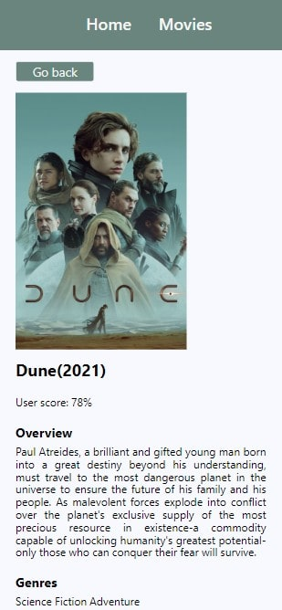
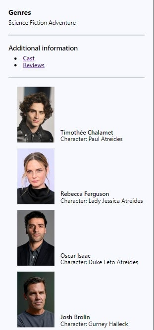
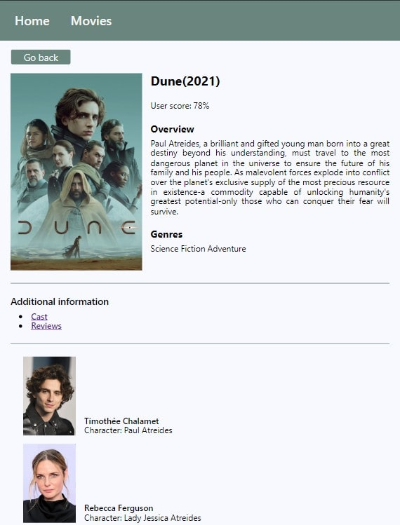

# MovieHub :movie_camera:

This project was created using [Create React App](https://github.com/facebook/create-react-app)

I used: 
1. For styling: styled-components, react-icons, react-loader-spinner.
2. For database operations - Axios and [Themoviedb API](https://www.themoviedb.org/) service.

____
Adapted for different screen sizes.

